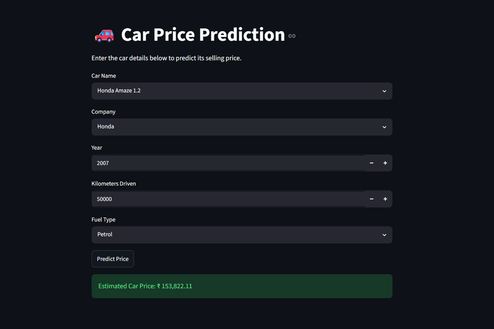

# 🚗 Car Price Prediction Using Machine Learning

Predict the estimated selling price of a used car based on its specifications using Machine Learning and Streamlit.

---

## 📌 Project Overview

The **Car Price Prediction** project is a machine learning application that estimates the selling price of a used car based on important features such as the car name, company, manufacturing year, kilometers driven, and fuel type.

The project uses a **Scikit-learn Pipeline** that combines data preprocessing and a regression model into a single workflow. Categorical features are encoded using **One-Hot Encoding**, while numerical features are passed directly to the model using a **ColumnTransformer**. The trained pipeline is saved using **Pickle** and integrated into a **Streamlit** web application for real-time predictions.

This project demonstrates the complete machine learning lifecycle, including data preprocessing, model training, evaluation, serialization, and deployment.

---

## 🚀 Features

* Predicts the selling price of used cars.
* Interactive Streamlit web application.
* Machine learning pipeline with automated preprocessing.
* One-Hot Encoding for categorical variables.
* Supports real-time predictions.
* Easy deployment using Streamlit Community Cloud.

---

## 🛠️ Technologies Used

* Python
* Pandas
* NumPy
* Scikit-learn
* Streamlit
* Pickle

---

## 📂 Dataset Features

The model uses the following input features:

* **Car Name**
* **Company**
* **Manufacturing Year**
* **Kilometers Driven**
* **Fuel Type**

---

## ⚙️ Machine Learning Workflow

1. Load the dataset.
2. Clean and preprocess the data.
3. Encode categorical features using One-Hot Encoding.
4. Split the dataset into training and testing sets.
5. Create a preprocessing pipeline using `ColumnTransformer`.
6. Train the regression model.
7. Evaluate model performance.
8. Save the trained pipeline using Pickle.
9. Deploy the application with Streamlit.

---

## 📊 Model Evaluation

The model is evaluated using regression metrics such as:

* R² Score
* Mean Absolute Error (MAE)
* Mean Squared Error (MSE)
* Root Mean Squared Error (RMSE)

---

## 📁 Project Structure

```text
Car-Price-Prediction/
│── app.py
│── car_price_model.pkl
│── Cleaned_Car_data.csv
│── requirements.txt
│── README.md
```

---

## ▶️ Installation

Clone the repository:

```bash
git clone https://github.com/yashpalsaini01/car-price-prediction.git
```

Navigate to the project folder:

```bash
cd car-price-prediction
```

Install the required libraries:

```bash
pip install -r requirements.txt
```

Run the Streamlit application:

```bash
streamlit run app.py
```

---

## 🌐 Deployment

The application can be deployed using **Streamlit Community Cloud**:
https://car-price-pridiction-vnjy3tpizan72qfnseabzh.streamlit.app/
1. Push the project to GitHub.
2. Visit Streamlit Community Cloud.
3. Connect your GitHub account.
4. Select the repository.
5. Choose `app.py` as the main file.
6. Click **Deploy**.

---

## 📷 Application Preview

Here is a preview image for the app interface:




---

## 🔮 Future Improvements

* Include additional features such as transmission type and ownership history.
* Improve prediction accuracy using advanced regression algorithms.
* Add data visualization and analytics.
* Compare predictions across multiple machine learning models.

---

## ⚠️ Disclaimer

The predicted car price is an estimate based on historical data and the features provided. Actual market prices may vary depending on the vehicle's condition, service history, location, ownership, and current market demand.

---

## 👨‍💻 Author

**Yashpal**

If you found this project useful, consider giving it a ⭐ on GitHub!
